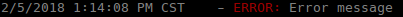
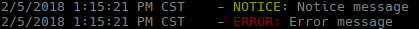
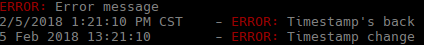
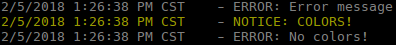
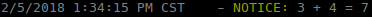

# Logger
##### current version 1.1.1dev
###### A simple, lightweight logger with support for custom prefixes, colored output, and leveled logging.

Installation
------

##### Get

```bash
go get github.com/KaiserGald/logger.git
```

##### Test

```bash
make all
```


Basic Usage
--------------

Logger is quite simple to get up and running. Simply create a new Logger, and start logging messages!

```go
  l := logger.New()
  l.Error.Log("Error message")
```

###### Output



Customizing Output
---

#### Setting Log Level

```go
  l := logger.New()
  l.SetLogLevel(Normal)

  l.Debug.Log("Debug Message")
  l.Info.Log("Info Message")
  l.Notice.Log("Notice Message")
  l.Error.Log("Error Message")  
```

###### Output


#### Setting log format

```go
  // returns a logger with timestamps disabled
  l := logger.New(false)    
  l.Error.Log("Error message")

  // re-enables timestamps
  l.ShowTimestamp(true)
  l.Error.Log("Timestamp's back")

  // sets timestamp format
  l.SetFormat(logger.LongDate | logger.Time24Hour)
  l.Error.Log("Timestamp change")
```

###### Output


#### Colors

##### Enable/Disable and Format Colors
```go
  // returns a logger with colors turned off
  l := logger.New(true, false)
  l.Error.Log("Error message")
  // turn colors back on for all but Error messages
  l.ShowColor(true)
  l.Error.ShowColor(false)

  // change the color format of the message
  l.Notice.SetColorFormat(logger.Timestamp | logger.Prefix | logger.Message)
  l.Notice.Log("COLORS!")
  l.Error.Log("No colors!")
```
###### Output


##### Change Colors
```go
  l := logger.New()

  l.Error.SetColorFormat(logger.Timestamp | logger.Prefix | logger.Message)
  l.Error.SetColors(logger.MagentaBg | logger.CyanFg)

  l.Error.Log("Color change")
```

###### Output


#### Formatted Messages
```go
  l := logger.New()
  x := 3
  y := 4
  l.Notice.Log("%v + %v = %v", x, y, x+y)
```
###### Output

